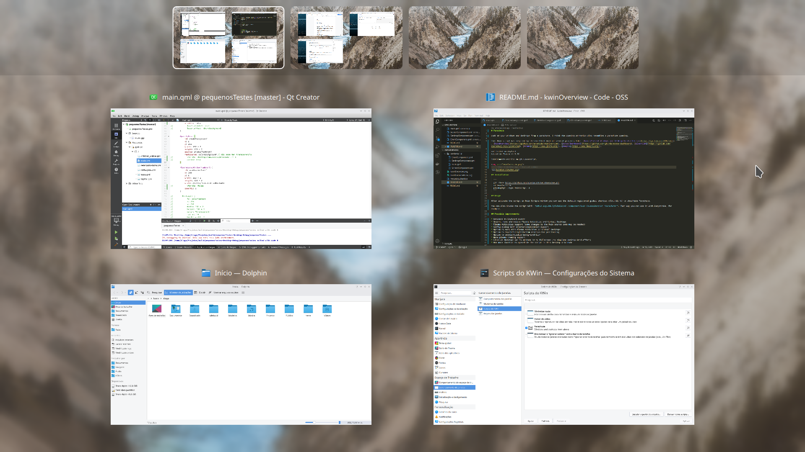

# Parachute

## This project is paused. Feel free to fork it if you want to improve it

<p align="center">
  
</p>

Look at your windows and desktops from above.

This *KWin* script was inspired by the excellent work of several projects like: [KWin (Present Windows and Desktop Grid effects)](https://github.com/KDE/kwin), [kwinOverview](https://github.com/astatide/kwinOverview), [qOverview](https://gitlab.com/bharadwaj-raju/QOverview), [Gnome](https://www.gnome.org/), [Deepin](https://www.deepin.org/).



## Installation or upgrade

  ```
  git clone https://github.com/tcorreabr/Parachute.git && cd Parachute
  make install
  ```

If you have installed through Plasma's Get Hot New Stuff ([Kde Store](https://store.kde.org/p/1370195/)) you must execute the following commands on terminal to install the configuration dialog. You only need to do this once.

  ```
  mkdir -p ~/.local/share/kservices5
  ln -s ~/.local/share/kwin/scripts/Parachute/metadata.desktop ~/.local/share/kservices5/Parachute.desktop
  ```

To uninstall, first go to the folder where you cloned Parachute, then run:

  ```
  make uninstall
  ```

## Usage

After activate the script in *KWin Scripts* window you can use the default registered global shortcut **Ctrl+Super+D (Ctrl+Meta+D)** to show/hide *Parachute*.
  
You can also invoke the script with: *qdbus org.kde.kglobalaccel /component/kwin invokeShortcut Parachute*. Similarly you can: integrate it with [easystroke](https://github.com/thjaeger/easystroke), [configure it to be invoked with meta key](https://github.com/tcorreabr/Parachute/issues/30), etc.

Controls:
* Left mouse button - Activate window.
* Middle mouse button - Close window.
* Right mouse button - (Un)pin window.
* Arrow keys - Select a window.
* Shift + Arrow keys - Switch desktops.
* Home/End - Select first/last window.
* Enter - Activate selected window.
* Esc - Hide Parachute.
* F5 - Update settings.

## Notes

* Developed and tested in *Plasma* >= 5.20 and *Qt* >= 5.15.
* For now it doesn't work on *Wayland*.
* You can use *KWin's* global shortcuts normally while using this script. To navigate between your desktops for example.
* If you are using "Slide" animation to switch desktops, you may want to enable the "Slide docks" option to avoid some [unwanted visual effects](https://github.com/tcorreabr/Parachute/issues/1).
* If you are having poor performance on animations, try changing "Scale method" to "Smooth" or "Crisp" in Compositor settings.
* If you have [Virtual Desktop Bar](https://github.com/wsdfhjxc/virtual-desktop-bar) installed, [Parachute keyboard shortcut may be ineffective](https://github.com/tcorreabr/Parachute/issues/14) until KWin restart or dynamic desktop operations.
